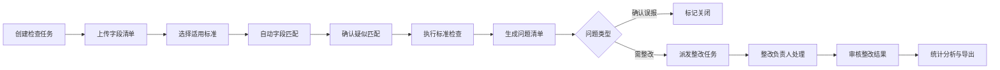

## 1. 产品概述

数据标准落地检查 Web 应用是面向数据治理人员的专业工具，用于验证项目字段是否符合企业统一数据标准。通过自动化检查、智能匹配和整改跟踪，帮助企业提升数据质量、保障数据标准化落地。

- 主要目的：提供一站式数据标准合规检查能力，降低人工审核成本
- 解决问题：数据字段命名不规范、取值不统一、标准落地难追踪等痛点
- 目标用户：数据治理专员、数据架构师、项目质量管理人员
- 产品价值：提升数据标准化执行效率，实现检查流程可追溯、可量化、可验收

## 2. 核心功能

### 2.1 用户角色

| 角色 | 注册方式 | 核心权限 |
|------|----------|----------|
| 数据治理人员 | 企业内部账号 | 创建检查任务、执行标准检查、确认问题、派发整改、查看统计分析 |
| 项目整改负责人 | 企业内部账号 | 接收整改任务、提交修正结果、查看整改进度 |

### 2.2 功能模块

1. **检查任务页面**：任务列表、新建任务、上传字段清单、选择适用标准范围
2. **字段匹配页面**：自动匹配展示、疑似匹配推荐、人工确认匹配结果
3. **问题清单页面**：命名规范检查、取值范围校验、整改建议生成、批量误报确认
4. **整改跟踪页面**：整改任务派发、整改进度跟踪、修正结果审核
5. **统计分析页面**：项目达标率看板、按标准违规分布、导出检查明细

### 2.3 页面详情

| 页面名称 | 模块名称 | 功能描述 |
|----------|----------|----------|
| 检查任务 | 任务列表 | 展示所有检查任务，支持按状态/时间筛选搜索 |
| 检查任务 | 新建任务 | 填写任务名称、关联项目、上传 CSV/Excel 字段清单 |
| 检查任务 | 标准选择 | 树形结构展示数据标准目录，支持多选适用标准范围 |
| 字段匹配 | 匹配概览 | 显示匹配总数、已确认、待确认数量统计卡片 |
| 字段匹配 | 自动匹配列表 | 系统根据字段名、描述、数据类型自动匹配标准字段 |
| 字段匹配 | 疑似匹配 | 展示相似度较高的候选标准字段，支持人工选择确认 |
| 问题清单 | 问题分类 | 按命名不规范、取值越界、数据类型不符等分类筛选 |
| 问题清单 | 问题详情 | 展示问题字段当前值、标准要求、违规类型、整改建议 |
| 问题清单 | 批量操作 | 支持批量标记误报、批量派发整改、批量导出 |
| 整改跟踪 | 任务看板 | 按待整改/整改中/已审核/已关闭状态分类展示 |
| 整改跟踪 | 任务派发 | 指定整改负责人、设置截止日期、添加整改说明 |
| 整改跟踪 | 结果审核 | 查看整改提交内容、对比修正前后、审核通过或驳回 |
| 统计分析 | 达标率看板 | 项目整体达标率、各维度达标率趋势图 |
| 统计分析 | 违规分布 | 按标准类别、问题类型统计违规数量分布图表 |
| 统计分析 | 明细导出 | 支持导出完整检查报告（Excel/PDF）供项目验收使用 |

## 3. 核心流程

用户创建检查任务后上传字段清单，选择适用的数据标准范围；系统自动进行字段匹配并生成疑似匹配项，由用户确认后执行标准检查；检查发现的问题生成整改建议，支持批量确认误报或派发整改任务；整改完成后审核确认，最终通过统计分析看板查看达标率并导出验收报告。

## 4. 用户界面设计

### 4.1 设计风格

- **主色调**：深海蓝 `#1e3a5f`，传递专业、可靠的企业级数据治理气质
- **辅助色**：翡翠绿 `#10b981`（达标/通过）、琥珀橙 `#f59e0b`（待处理/警告）、玫红 `#ef4444`（违规/问题）
- **中性色**：以 slate 灰为基底，营造干净、高效的数据看板氛围
- **按钮风格**：扁平化圆角按钮（`rounded-lg`），悬停有微高光和阴影过渡
- **字体**：使用 "Noto Sans SC" 中文显示字体搭配 "JetBrains Mono" 等宽字体展示代码/字段名
- **布局风格**：左侧固定侧边栏导航 + 顶部状态栏 + 主内容区卡片式布局
- **图标风格**：统一使用 Lucide React 线性图标，保持简洁专业

### 4.2 页面设计总览

| 页面名称 | 模块名称 | UI 元素 |
|----------|----------|----------|
| 检查任务 | 任务列表 | 搜索框、筛选下拉、数据表格、状态标签、操作按钮组 |
| 检查任务 | 新建任务弹窗 | 表单输入、文件拖拽上传区、标准树选择器、步骤指示器 |
| 字段匹配 | 匹配概览 | 彩色统计卡片、进度条、匹配度分布迷你图 |
| 字段匹配 | 匹配列表 | 左右对照布局（待检查字段 vs 标准字段）、匹配度百分比、确认/拒绝按钮 |
| 问题清单 | 问题列表 | 分类 Tab、数据表格、违规类型标签、批量操作工具栏 |
| 问题清单 | 问题详情侧边栏 | 字段信息卡、标准要求对比、整改建议文本、操作按钮 |
| 整改跟踪 | 任务看板 | 四列 Kanban 布局、任务卡片、拖拽交互、负责人头像 |
| 整改跟踪 | 审核弹窗 | 整改前后对比、审核意见输入、通过/驳回操作 |
| 统计分析 | 达标率看板 | 大数字指标卡、环形进度图、时间趋势折线图 |
| 统计分析 | 违规分布 | 柱状图、饼图、数据表格、导出按钮组 |

### 4.3 响应式

- 桌面端优先（Desktop-first）设计，最小支持 1280px 宽度
- 侧边栏在平板端可折叠收起，移动端使用底部 Tab 导航
- 数据表格在窄屏自动切换为卡片列表展示
- 图表容器自适应宽度，保持良好可读性

