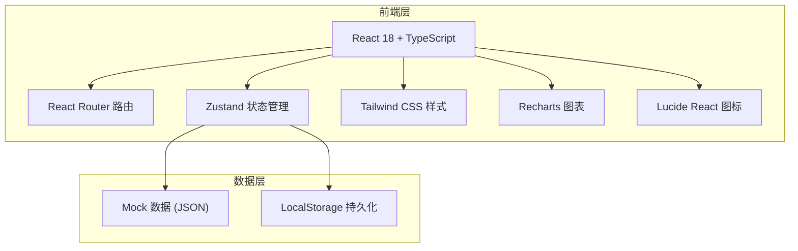
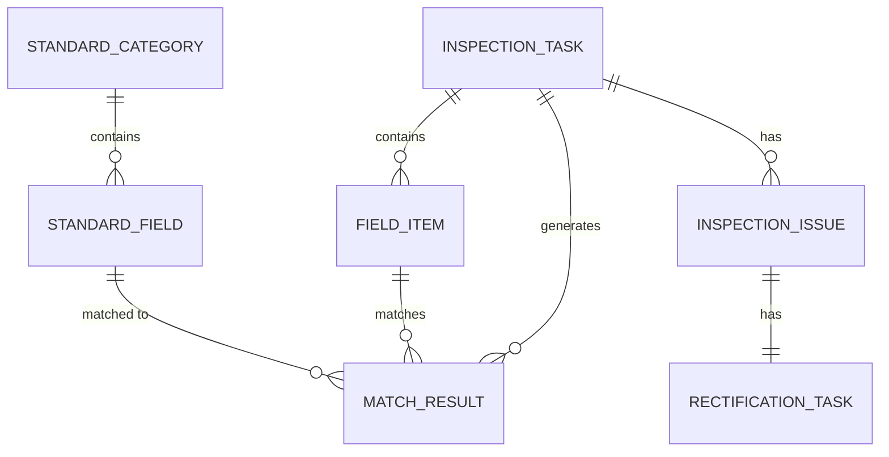

## 1. 架构设计



## 2. 技术说明

- **前端框架**：React@18 + TypeScript@5
- **构建工具**：Vite@5
- **路由**：react-router-dom@6
- **状态管理**：zustand@4
- **样式方案**：tailwindcss@3 + postcss
- **图表库**：recharts@2
- **图标库**：lucide-react@0.344
- **后端**：纯前端 Mock 数据，使用 LocalStorage 模拟持久化
- **数据库**：无后端数据库，使用前端 JSON Mock 数据

## 3. 路由定义

| 路由 | 用途 |
|------|------|
| / | 重定向至检查任务页 |
| /tasks | 检查任务列表与新建 |
| /tasks/:id/matching | 字段匹配页面 |
| /tasks/:id/issues | 问题清单页面 |
| /rectification | 整改跟踪页面 |
| /analytics | 统计分析页面 |

## 4. API 定义（Mock 接口层）

```typescript
// 检查任务
interface InspectionTask {
  id: string;
  name: string;
  projectName: string;
  status: 'draft' | 'matching' | 'inspecting' | 'rectifying' | 'completed';
  fieldCount: number;
  matchedCount: number;
  issueCount: number;
  standardScope: string[];
  createdAt: string;
  updatedAt: string;
}

// 待检查字段
interface FieldItem {
  id: string;
  taskId: string;
  fieldName: string;
  fieldDescription: string;
  dataType: string;
  sampleValue?: string;
  tableName: string;
}

// 标准字段
interface StandardField {
  id: string;
  standardCode: string;
  fieldName: string;
  fieldDescription: string;
  dataType: string;
  valueRange?: string[];
  namingRule: string;
  categoryId: string;
}

// 字段匹配结果
interface MatchResult {
  id: string;
  fieldId: string;
  standardFieldId?: string;
  matchScore: number;
  status: 'pending' | 'confirmed' | 'rejected';
  candidates?: { standardFieldId: string; score: number }[];
}

// 检查问题
interface InspectionIssue {
  id: string;
  taskId: string;
  fieldId: string;
  fieldName: string;
  issueType: 'naming' | 'value_range' | 'data_type' | 'format';
  severity: 'high' | 'medium' | 'low';
  currentValue: string;
  standardRequirement: string;
  suggestion: string;
  status: 'open' | 'false_positive' | 'rectifying' | 'resolved';
  assignee?: string;
  deadline?: string;
}

// 整改任务
interface RectificationTask {
  id: string;
  issueId: string;
  taskId: string;
  assignee: string;
  deadline: string;
  status: 'pending' | 'in_progress' | 'submitted' | 'approved' | 'rejected';
  rectificationContent?: string;
  submittedAt?: string;
  reviewedAt?: string;
  reviewComment?: string;
}
```

## 5. 数据模型



## 6. 目录结构

```
src/
├── components/          # 可复用组件
│   ├── layout/         # 布局组件（Sidebar、Header）
│   ├── ui/             # 基础 UI 组件（Button、Card、Table、Modal、Tag）
│   └── charts/         # 图表组件
├── pages/              # 页面组件
│   ├── Tasks.tsx       # 检查任务页
│   ├── Matching.tsx    # 字段匹配页
│   ├── Issues.tsx      # 问题清单页
│   ├── Rectification.tsx # 整改跟踪页
│   └── Analytics.tsx   # 统计分析页
├── store/              # Zustand 状态管理
│   └── useStore.ts
├── mock/               # Mock 数据
│   ├── tasks.ts
│   ├── standards.ts
│   ├── fields.ts
│   └── issues.ts
├── types/              # TypeScript 类型定义
│   └── index.ts
├── utils/              # 工具函数
│   ├── matcher.ts      # 字段匹配算法
│   ├── inspector.ts    # 标准检查逻辑
│   └── export.ts       # 导出工具
├── App.tsx
├── main.tsx
└── index.css
```
